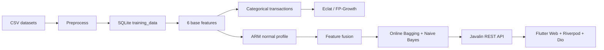

# SQLIA 專題核心技術學習筆記

> 本筆記依目前 `sqlia_app` 與 `sqlia_web` 的實際程式碼、依賴與資料流整理。重點是理解本專題真正使用的技術，而不是泛泛介紹所有相關工具。

## 1. 專題全貌

本專題是一個 SQL Injection Attack（SQLIA/SQLi）偵測平台，將三類工作串在一起：

1. **資料工程**：讀取多個 CSV，統一欄位與編碼，清理、驗證、去重、切分資料。
2. **特徵與模型**：從 SQL/HTTP payload 萃取六維特徵，轉成關聯規則探勘的 transaction，再以 ARM 訊號融合線上機器學習分類器。
3. **應用系統**：Java 後端提供 REST API，Flutter Web 前端做偵測、模擬、規則查詢、架構比較與線上學習監控。



### 1.1 技術分層

| 層次 | 實際技術 | 專題用途 |
|---|---|---|
| 語言 | Java 21、Dart 3.13+、Python | 後端/演算法、前端、離線繪圖 |
| 建置 | Maven、Flutter CLI/pub | Java 相依管理與編譯、Flutter 建置 |
| 儲存 | SQLite、JDBC、CSV | 訓練資料、特徵、split metadata、原始資料 |
| SQL 分析 | JSqlParser、Java regex | 合法 SQL/HTTP 判斷、字元與語法型特徵 |
| 關聯規則 | SPMF、Eclat、FP-Growth、Agrawal rules | 發現常見 feature item 組合 |
| ML | Weka、XGBoost4J | 離線模型比較與線上增量分類 |
| 後端 | Javalin、Jackson、REST/JSON、CORS | 提供偵測與實驗 API |
| 前端 | Flutter、Material 3、Riverpod、Dio、fl_chart | Web 操作介面、狀態管理、HTTP、圖表 |
| 繪圖 | Python matplotlib、pandas、networkx | 實驗結果、ARM 關聯圖與準確率圖 |

## 2. Java 與 Maven 基礎

### 2.1 Java 21

`sqlia_app` 的 `pom.xml` 將 source/target 設為 21。專案使用：

- class、interface、package 組織後端模組。
- record，例如 `PreparedData`，用來承載不可變的資料結果。
- try-with-resources 管理 `Connection`、`PreparedStatement`、`ResultSet`、檔案 reader。
- collections、stream、lambda、regular expression。
- synchronized 與 `volatile` 保護線上模型狀態。

### 2.2 Maven

Maven 以 `pom.xml` 定義座標、Java 版本與 dependencies。常用流程：

```bash
mvn clean
mvn compile
mvn test
mvn exec:java
mvn exec:java@api
```

核心 dependency：

- `commons-csv`：解析不同資料集的 CSV。
- `sqlite-jdbc`：透過 JDBC 連接 SQLite。
- `jsqlparser`：將文字嘗試解析成 SQL。
- `spmf`：執行 Eclat、FP-Growth 與 Agrawal association rules。
- `weka-stable`：分類器、Instances、Evaluation、updateable Naive Bayes。
- `xgboost4j_2.12`：Java 呼叫 XGBoost。
- `javalin`：輕量 HTTP/REST server。
- `jackson-databind`：JSON request/response mapping。

## 3. 資料工程管線

主要入口是 `DataImporter` 呼叫 `DatasetPreprocessor.prepare()`。

### 3.1 多來源 CSV 統一

目前來源是：

- `Modified_SQL_Dataset.csv`：payload 欄位 `Query`、標籤 `Label`。
- `sqli.csv`：payload 欄位 `Sentence`、標籤 `Label`。
- `SQLiV3.csv`：payload 欄位 `Sentence`、標籤 `Label`。

`CsvUnifier` 將不同欄名、可能不同文字編碼的檔案轉成共同的 `RawRecord`。這是資料整合的核心：下游不應再依賴原始資料集的欄位名稱。

### 3.2 清理與品質控管

1. `LabelValidator`：確認標籤格式與允許值。
2. `BenignSqlValidator`：對 label=0 的資料做額外驗證。
   - 若符合 HTTP-like pattern，例如 `GET /...` 或 query string，視為可接受。
   - 否則嘗試用 JSqlParser parse。
   - parse 失敗的 benign row 會被排除，避免「無效字串」污染正常類別。
3. 移除空白 payload。
4. `Deduplicator`：去除重複資料，並保留 source 資訊。
5. 輸出 `data/processed/combined_preprocessed.csv`。

### 3.3 分割資料與避免 leakage

使用兩種 evaluation view：

- **Group-aware stratified split**：先將正規化後相同的 payload 放在同一 group，再按 group 的多數標籤做 train/validation/test 分割。預設比例是 70%/15%/15%，seed=42。
- **Source holdout**：完整保留 `SQLiV3` 作為未見來源測試，其餘來源作訓練，用來測試跨資料來源泛化能力。

為什麼重要：如果同一 payload 的變形或重複內容同時進入 train 與 test，分數會被資料洩漏（data leakage）高估。

### 3.4 SQLite schema

`training_data` 主要欄位：

- `raw_sql`：原始 payload。
- `feature_vector`：六維特徵的文字表示。
- `label`：0=benign、1=malicious。
- `source`：資料來源。
- `split_group`：train/validation/test。
- `batch_seq`：stream batch 順序。
- `is_trained`：增量處理旗標。
- `created_at`：建立時間。

`UNIQUE(source, raw_sql)` 防止同來源重複；`idx_is_trained` 與 `idx_batch_seq` 加速增量掃描與 batch 查詢。

### 3.5 JDBC、PreparedStatement 與 transaction

資料插入使用 `PreparedStatement`，值以 `?` 綁定，避免把資料直接串進 SQL。大量匯入時關閉 auto-commit，以 batch execute + commit 提升效能；失敗則 rollback。

要分清兩件事：

- **應用程式自己的 SQL**：使用 prepared statement 保護查詢。
- **被偵測的 raw SQL**：是資料，不應直接執行；系統只對它做文字、解析與特徵處理。

## 4. 六維特徵工程

`FeatureExtract.extract()` 對 payload 先 trim，再嘗試 URL decode；若 decode 失敗則使用原文。輸出固定六維向量：

| index | 名稱 | 計算概念 | 直覺 |
|---:|---|---|---|
| 0 | payload length | 字元數 | 長 payload 可能包含更多攻擊構造 |
| 1 | symbol density | 非英數且非空白字元數 / 長度 | 特殊符號密度 |
| 2 | comparison density | 比較運算子數 / 長度 | `=`, `>`, `<`, `<>`, `!=` 等 |
| 3 | complexity | 是否出現字母、數字、符號，各為 0/1 後相加 | 0 到 3 的組成複雜度 |
| 4 | function density | SQL function call 次數 / 長度 | `UNION` 以外的函式型 payload 特徵，例如 `CHAR(`、`SUBSTRING(` |
| 5 | discontinuous density | whitespace/control character 數 / 長度 | 分隔、空白與編碼混淆程度 |

密度的一般公式是：

$$density(f)=\frac{count(f)}{\max(|payload|,1)}$$

比較運算子 regex 使用 lookaround，避免把複合運算子拆錯。函式名稱以白名單集合判斷，並以 `FUNCTION\s*\(` 形式計數。

### 4.1 特徵工程的限制

- 這是手工設計的 lexical/statistical feature，不是完整 SQL AST embedding。
- `countDiscontinuous()` 目前主要算 whitespace/control character，註解計數程式被保留但未啟用。
- URL decode 會影響長度與密度，因此同一 payload 的 encoded/decoded 形式可能產生不同向量。
- 只用六個特徵易解釋、速度快，但表達能力有限，需靠 ARM 訊號與模型補強。

## 5. ARM：將連續特徵離散化

Association Rule Mining 需要 transaction/item，而不是直接吃 double。`FeatureForML.toTransactionSet()` 將六維向量轉成 item ID：

- 長度大於 100：item 1。
- symbol density 大於 0.30：item 2。
- comparison density：0 記為 3，低值記為 30，高值記為 33。
- complexity：記為 `40 + complexity`，即 40 到 43。
- function density：0 記為 5，低值記為 50，高值記為 55。
- discontinuous density 大於 0.30：item 6。

這種設計稱為 discretization/binning。好處是把連續特徵轉成可解釋的「事件是否出現」；代價是門檻附近的細微差異會被壓平。

### 5.1 Quantile discretization

`FeatureDiscretizer` 是另一套以 q50/q90 為門檻的離散方法：

- 一般特徵：LOW/MEDIUM/HIGH。
- comparison/function：ZERO/NONZERO_LOW/NONZERO_HIGH，因為 0 的比例很高。
- complexity：直接使用 0 到 3。

固定 threshold 與 quantile threshold 是兩種不同實驗策略：前者可重現且容易說明，後者較貼近資料分布。

## 6. Eclat、FP-Growth 與關聯規則

### 6.1 Frequent itemset

給定交易集合 $T$ 與 itemset $X$：

$$support(X)=\frac{|\{t\in T:X\subseteq t\}|}{|T|}$$

minSup 用來過濾太少見的組合。支援度高表示組合常出現，不代表因果關係。

### 6.2 Eclat

Eclat 使用 vertical data format，概念上為每個 item 維護包含它的 transaction ID set，交集可得到 itemset 的支持度。

- 優點：集合交集清楚，對稀疏交易常有效。
- 輸出本專題中的 frequent itemsets，例如 `3 4 #SUP: ...`。
- Eclat 輸出沒有 antecedent/consequent，因此後端使用 itemset parser。

### 6.3 FP-Growth

FP-Growth 先建立 FP-tree，再以 conditional pattern base 遞迴挖掘 frequent itemsets，不需要枚舉所有候選集。

- 優點：避免 Apriori 式大量 candidate generation。
- 可接 Agrawal 1994 rule generation 產生 association rules。
- 本專題使用 minSup=0.05 或 0.1，以及 minConf=0.6 或 0.8。

### 6.4 Association rule

規則形式為 $X\Rightarrow Y$。信賴度：

$$confidence(X\Rightarrow Y)=\frac{support(X\cup Y)}{support(X)}$$

confidence 高表示在出現 X 的交易中，Y 常一起出現，但仍不代表因果。後端 `RuleMiningService` 解析：

```text
3 ==> 4 #SUP: 5424 #CONF: 0.6467
```

### 6.5 ARM 與分類器整合

`FeatureForML` 將：

- base six features
- pattern match 的 0/1
- rule match 的 confidence

串成較長的 feature vector。這是 feature augmentation，不是直接用規則取代分類器。

## 7. ARM normal profile 與三種架構

`ArmNormalProfile` 只收錄經確認為 benign 的 transaction，計算每個 item 在正常交易中的出現次數。

對新 transaction：

- `ruleMatch`：所有 item 都看過則為 1，否則 0。
- `violationRatio`：未見過 item 數 / 本次 item 數。
- `anomalyScore`：$1-averageSupport$。

線上服務的三條比較路徑：

1. **ARM_PROFILE**：直接用 anomaly score >= 0.5 判定 malicious。
2. **RATIO_INCREMENTAL_ML**：六維 base feature 送進獨立的 online bagging。
3. **FULL_FLOW**：六維 base feature + ARM 的三個衍生訊號，送進主要 online bagging。

回饋政策很重要：

- 所有 verified label 都更新 ML。
- 只有 `verifiedBenign=true` 且 label=0 才更新 ARM normal profile。
- verified SQLi 不可污染 benign profile，避免攻擊樣本被學成正常模式。

## 8. Weka 與線上增量學習

### 8.1 Weka 基本概念

Weka 用 `Instances` 表示資料集、`Attribute` 表示欄位，最後一個 attribute 設為 class index。`NaiveBayesUpdateable` 支援逐筆 `updateClassifier()`。

### 8.2 Online Bagging

`OnlineBagging` 建立多個 base classifier，每筆新資料對每個 classifier 抽樣 $k\sim Poisson(1)$，並重複更新 $k$ 次。這是在串流場景近似 bootstrap bagging：

- 每個 classifier 看到不同權重的資料。
- 預測時平均全部 classifier 的 class probability。
- label=1 機率 >= 0.5 時判成 malicious。

主服務使用 ensemble size=15；warmup 預設最多讀 2000 筆。另建立一組 ratio-only ensemble，避免與融合架構混用。

### 8.3 Warmup 與 evaluation order

模型啟動時先用 `split_group='train'` 的資料 warm up。程式特別避免 warmup 只有單一類別，因為 Naive Bayes 可能產生飽和的 100% 信心。

模擬時採用：

1. 先預測未知資料。
2. 記錄 TP/FP/TN/FN 與 accuracy history。
3. 若 `updateModel=true`，才用真實 label 更新模型。

這個順序避免把答案先餵給模型再評估，否則會造成 evaluation leakage。

## 9. 離線模型比較

`MLTrainer` 會在不同 situation 下建立特徵：

1. 純 base features。
2. base + minSup=0.05 frequent patterns。
3. base + minSup=0.1 frequent patterns。
4. base + rules minSup=0.1/minConf=0.6。
5. base + rules minSup=0.05/minConf=0.6。
6. base + rules minSup=0.05/minConf=0.8。
7. base + rules minSup=0.1/minConf=0.8。

離線比較的分類器：

- **Random Forest**：多棵決策樹的 bagging，降低 variance。
- **REPTree/CART-like tree**：以樹切分特徵，容易解釋。
- **XGBoost**：gradient boosting tree；目前參數包含 `objective=binary:logistic`、eta=0.1、max_depth=6、50 rounds。
- **SMO/SVM**：尋找分類 margin，適合高維或邊界清楚的資料。
- **Naive Bayes**：以條件獨立假設估計後驗機率，速度快，適合作 baseline 與線上更新。
- **LogitBoost**：程式中的 `runLightGBM()` 實際用 Weka LogitBoost 模擬比較，不是真正的 LightGBM。報告中必須如實區分。

## 10. 評估指標

以 malicious=1 為正類：

- TP：惡意且預測惡意。
- TN：正常且預測正常。
- FP：正常卻誤報惡意。
- FN：惡意卻漏報正常。

$$accuracy=\frac{TP+TN}{TP+TN+FP+FN}$$

$$precision=\frac{TP}{TP+FP}$$

$$recall=\frac{TP}{TP+FN}$$

$$F1=\frac{2\cdot precision\cdot recall}{precision+recall}$$

SQLi 防禦通常特別重視 recall，因為 FN 代表漏掉攻擊；但 precision 也不能忽略，否則正常查詢會大量被阻擋。資料不平衡時不能只看 accuracy，應同時看 confusion matrix、precision、recall、F1，必要時看每一類與 macro-F1。

## 11. Javalin REST API

`ApiServer` 在 `localhost:8080` 啟動 Javalin，使用 Jackson 將 JSON body 映射成 DTO。主要 endpoints：

| Method | Path | 用途 |
|---|---|---|
| POST | `/api/detect` | 單筆 SQL/HTTP 偵測、信心度、特徵 |
| POST | `/api/architectures/predict` | 同一輸入跑三種架構 |
| GET | `/api/incremental/status` | warmup、訓練數、normal profile 狀態 |
| GET | `/api/stats/accuracy` | 線上準確率歷史 |
| POST | `/api/simulation/jobs` | 建立資料集模擬工作 |
| GET | `/api/simulation/jobs/{jobId}` | 查詢工作狀態與結果 |
| POST | `/api/performance/compare` | 對三架構做同批資料比較 |
| POST | `/api/incremental/feed` | 預測，可附真實 label 增量更新 |
| POST | `/api/feedback/verified` | 套用可信回饋，選擇性更新 ARM |
| GET | `/api/rules?ruleSetId=...` | 讀取並解析 SPMF 規則檔 |

### 11.1 API 安全與可靠性

- SQL input 上限 4000 字元，拒絕 null/blank。
- simulation dataset path 必須位於 `data/` root 下，避免任意檔案讀取。
- CORS 已開啟，方便 Flutter Web 呼叫。
- simulation 使用背景 job + polling；前端每 700ms 查一次狀態。
- CSV parser 支援 header，並處理 BOM/UTF-8、UTF-16LE、UTF-16BE。

## 12. Flutter、Dart 與前端架構

### 12.1 Flutter 基礎

`main.dart` 以 `runApp(ProviderScope(child: SqliaApp()))` 啟動。Flutter UI 由 widget tree 組成：

- `StatelessWidget`：輸入不變時呈現 UI。
- `StatefulWidget`：輸入框、loading、timer、結果等可變狀態。
- `MaterialApp` + Material 3 theme。
- `Navigator` + `MaterialPageRoute` 做多頁導覽。

### 12.2 Riverpod

`ProviderScope` 提供依賴注入與狀態容器。`detection_provider.dart` 定義：

- `Provider<ApiClient>`。
- 各 service provider。
- `FutureProvider.family<DetectResult, String>`：以 SQL 字串作 key，非同步取得偵測結果。

`ref.watch()` 會建立反應式依賴；`ref.read()` 適合在按鈕事件中呼叫一次 service。`AsyncValue.when(data/loading/error)` 將非同步狀態映射到 UI。

### 12.3 Dio 與 JSON model

`ApiClient` 封裝 Dio，base URL 預設為 `http://localhost:8080`，connect timeout 10 秒。各 service 只負責 endpoint 與 JSON 轉換：

- `DetectionService`：單筆 detection。
- `ArchitectureService`：三架構 prediction/performance。
- `SimulationService`：建立工作與查詢工作。
- `IncrementalService`：status、accuracy、feed。
- `RuleService`：取得 association rules。

models 以 `fromJson` 將 `Map<String,dynamic>` 轉為 Dart domain object，讓畫面不必直接處理原始 JSON。

### 12.4 fl_chart 與互動流程

`fl_chart` 用於：

- 三種架構的 accuracy/precision/recall/F1 長條圖。
- 線上 accuracy history 折線圖。
- 規則 confidence 圖表。

simulation 畫面使用 `Timer.periodic` polling；頁面 dispose 時取消 timer，避免 widget 已卸載後仍更新狀態。

### 12.5 尚未實際使用的技術

`lib/core/ws_client.dart` 目前是空檔案，因此目前通訊實際上是 REST + polling，不是 WebSocket。這是報告中需要明確說明的邊界。

## 13. Python 實驗工具

`Scripts/` 使用：

- `pandas`：讀取與整理模型/準確率結果。
- `matplotlib`：畫 accuracy、ML 比較圖。
- `networkx`：畫 ARM 關聯規則圖。
- `argparse`、`pathlib`、`re`：命令列參數、路徑與規則文字解析。

Python 工具是實驗分析/視覺化，不是線上偵測服務的核心 runtime。

## 14. 建議學習順序

1. Java 21、Maven、例外處理與 try-with-resources。
2. SQL、SQLite、JDBC、prepared statement、transaction/index。
3. CSV schema、資料清理、deduplication、stratified split、data leakage。
4. regex、URL decoding、SQL parser 與 lexical feature engineering。
5. normalization、discretization、support/confidence。
6. Eclat、FP-Growth、association rule 的差異。
7. confusion matrix、precision/recall/F1 與 class imbalance。
8. Weka Instances/Classifiers、Naive Bayes 與 online update。
9. bagging、Poisson bootstrap、ensemble probability averaging。
10. Javalin REST、Jackson DTO、CORS、背景工作與 polling。
11. Dart/Flutter widget tree、Riverpod、Dio、JSON model、fl_chart。
12. Python pandas/matplotlib/networkx 做實驗結果解讀。

## 15. 建議實作練習

- 為 `FeatureExtract` 加入參數化測試：空字串、URL encoded payload、comment、複合比較運算子。
- 比較固定 threshold 與 quantile threshold 對 support/rule 數量的影響。
- 製作一個小型 transaction dataset，手算 support 與 confidence，再對照 SPMF。
- 讓 warmup 明確保證兩個 label 都存在，並比較單類別 warmup 的 probability 行為。
- 實作一次不更新模型的 simulation，再與 `updateModel=true` 比較，理解 online learning 的 drift。
- 對同一批 holdout source 報告三架構的 confusion matrix，而不只報 accuracy。
- 為 API 加入 integration test，確認 4000 字元限制、path traversal 與未知 ruleSetId 會被拒絕。
- 為 Flutter service 建立 mock Dio 測試，確認 HTTP error 能正確映射成 UI error。

## 16. 目前程式應在報告中誠實標示的限制

1. 線上 API 實際分類器是 Weka `NaiveBayesUpdateable` 的 online bagging；XGBoost、Random Forest、SVM 等主要是離線比較，不是 API 預設模型。
2. `runLightGBM()` 使用 LogitBoost 作為替代模擬，不是 LightGBM library。
3. ARM normal profile 目前以 item 出現統計衍生 anomaly/rule-match 訊號，並非完整的傳統 association rule classifier。
4. 模型狀態存在 Java process memory；重啟 API 後需重新 warmup，除非另行加入 model persistence。
5. 前端目前用 REST polling 取得 simulation 狀態，WebSocket client 尚未實作。
6. 特徵是可解釋的手工統計特徵，對新型態、編碼變形或複雜語法的泛化能力需要透過 holdout 與額外資料驗證。

## 17. 一句話總結

這個專題的核心不是單一分類器，而是：**以資料品質與 leakage 控制為基礎，將 SQL payload 轉成可解釋的六維特徵與 ARM item，再把 benign profile 訊號融合進可增量更新的 Naive Bayes ensemble，透過 Java REST API 讓 Flutter 介面可觀測、可比較、可回饋。**
